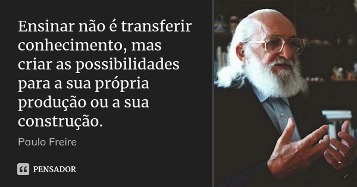

[]
# Back Laravel - Laravel a fundo 

Back laravel é um projeto que visa trazer uma serie de videos aprofundando o conhecimento em laravel e sua funcionalidades com conteúdos 100% em portugues. Voltado para o público que está iniciando no framework .

  - Todos os videos serão postados meu canal do youtube  [Allex Nogue](https://youtube.com/AllexNogue) 

# Materiais 
Segue a lista a baixo de nossos materiais para estudo.

| Autor | Titulo | Vídeo |
| ------ | ------ | ------- |
| [Allex Nogue](https://alexnogueira.com/) | [Simplificando a busca de dados com Eloquent][PlDb] | X |

-------------
Veja [como contribuir]().
